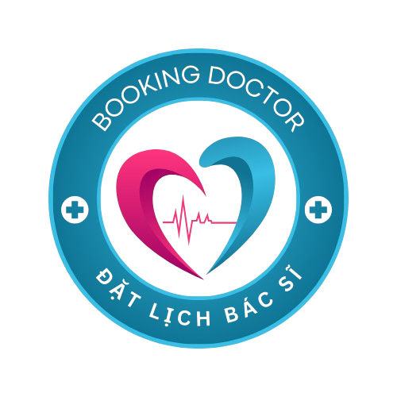

<p align="center">
  
</p>

<h1 align="center">Doctor Booking System</h1>

<p align="center">
  <strong>Clinic Appointment System -- He thong dat lich kham benh truc tuyen</strong>
</p>

<p align="center">
  
  
  
  
  
  
</p>

---

## Table of Contents

- [Project Overview](#project-overview)
- [Features](#features)
- [Tech Stack](#tech-stack)
- [Prerequisites](#prerequisites)
- [Folder Structure](#folder-structure)
- [Setup Instructions](#setup-instructions)
- [Running the Project](#running-the-project)
- [Demo Accounts](#demo-accounts)
- [Roles & Routes](#roles--routes)
- [API Endpoints](#api-endpoints)
- [Design System](#design-system)
- [Troubleshooting](#troubleshooting)
- [Known Issues & Fixes](#known-issues--fixes)
- [Changelog](#changelog)
- [Deployment](#deployment)
- [Contributing](#contributing)
- [License](#license)
- [Author](#author)

---

## Project Overview

Doctor Booking System la he thong dat lich kham benh truc tuyen day du chuc nang, phuc vu 3 vai tro chinh: **Benh nhan (Patient)**, **Bac si (Doctor)** va **Quan tri vien (Admin)**.

He thong cho phep benh nhan tim kiem bac si, dat lich hen truc tuyen, thanh toan qua nhieu hinh thuc (tien mat, vi suc khoe, VNPay), nhan thong bao qua email va su dung tro ly AI de kiem tra trieu chung.

### Highlights

- Giao dien **tong mau den/trang** hien dai, chuyen nghiep
- Ho tro thanh toan truc tuyen qua **VNPay** va **Vi Suc khoe**
- Tro ly AI (**HealthAI Chat**) kiem tra trieu chung
- He thong thong bao qua **Email** tu dong
- Quan ly **ho so gia dinh** - dat lich cho nguoi than
- **Responsive** tren moi thiet bi

---

## Features

### Patient (Benh nhan)

| Chuc nang | Mo ta |
|---|---|
| Dat lich kham | Chon bac si, ngay, gio, phuong thuc thanh toan |
| Tim kiem bac si | Tim theo ten, chuyen khoa |
| Lich su kham | Xem, huy lich hen |
| Ho so dieu tri | Xem don thuoc, chan doan |
| Vi suc khoe | Nap tien, thanh toan, xem lich su giao dich |
| Ho so gia dinh | Them thanh vien, dat lich ho nguoi than |
| Phan hoi | Gui va chinh sua danh gia bac si |
| HealthAI Chat | Tro ly AI kiem tra trieu chung |

### Doctor (Bac si)

| Chuc nang | Mo ta |
|---|---|
| Dashboard | Thong ke lich hen, benh nhan, doanh thu |
| Quan ly lich hen | Xac nhan, tu choi, huy lich hen |
| Dieu tri | Tao don thuoc dien tu, ghi chu chan doan |
| Benh nhan | Xem danh sach, tim kiem benh nhan |

### Admin (Quan tri vien)

| Chuc nang | Mo ta |
|---|---|
| Dashboard | Thong ke tong quan he thong |
| Quan ly Users | CRUD tai khoan nguoi dung |
| Quan ly bac si | Duyet, cap nhat trang thai bac si |
| Quan ly benh nhan | Xem, tim kiem ho so benh nhan |
| Quan ly lich hen | Xem, sua, huy tat ca lich hen |
| Phan hoi | Xem va xu ly feedback tu benh nhan |

---

## Tech Stack

### Backend

| Technology | Version | Purpose |
|---|---|---|
| Java | 21 | Runtime |
| Spring Boot | 3.5.x | Framework |
| Spring Security | 6.x | JWT Authentication |
| Spring Data JPA | 6.x | ORM / Data Access |
| MySQL | 8.0 | Database |
| Lombok | latest | Reduce boilerplate |
| Jakarta Validation | 3.x | Input validation |
| Groq AI | API | AI Symptom Checker |
| VNPay | Sandbox | Online payment |

### Frontend

| Technology | Version | Purpose |
|---|---|---|
| React | 18.x | UI Library |
| Vite | 6.x | Build tool |
| React Router DOM | 7.x | Routing |
| Axios | 1.x | HTTP Client |
| Feather Icons | CDN | Icon set |
| Vanilla CSS | - | Styling (tong den/trang) |

### Infrastructure

| Technology | Purpose |
|---|---|
| Docker Compose | Local development |
| Render | Cloud deployment |
| Aiven | MySQL hosting |
| Gmail SMTP | Email notifications |

---

## Prerequisites

Truoc khi bat dau, hay dam bao ban da cai dat:

| Tool | Version | Kiem tra |
|---|---|---|
| **Java JDK** | 21+ | `java --version` |
| **Maven** | 3.9+ | `mvn --version` (hoac dung `./mvnw`) |
| **Node.js** | 18+ | `node --version` |
| **npm** | 9+ | `npm --version` |
| **MySQL** | 8.0+ | `mysql --version` |
| **Git** | latest | `git --version` |

---

## Folder Structure

```
Doctor-Booking-System/
|
|-- backend/                          # Spring Boot Backend
|   |-- src/main/java/com/doctorbooking/backend/
|   |   |-- config/                   # Security, CORS, JWT config
|   |   |-- controller/               # REST Controllers
|   |   |   |-- AdminController.java
|   |   |   |-- DoctorController.java
|   |   |   |-- PatientController.java
|   |   |   |-- AuthController.java
|   |   |   +-- PaymentController.java
|   |   |-- service/                  # Business logic
|   |   |   |-- AppointmentService.java
|   |   |   |-- WalletService.java
|   |   |   |-- EmailService.java
|   |   |   |-- AISymptomService.java
|   |   |   +-- VNPayService.java
|   |   |-- model/                    # JPA Entities
|   |   |-- dto/                      # Request/Response DTOs
|   |   |   |-- request/
|   |   |   +-- response/
|   |   |-- repository/               # Spring Data repositories
|   |   +-- exception/                # Global exception handlers
|   |-- src/main/resources/
|   |   +-- application.properties
|   |-- .env.example
|   +-- pom.xml
|
|-- frontend/                         # React + Vite Frontend
|   |-- src/
|   |   |-- components/
|   |   |   |-- common/               # Loading, AnimatedLogoutButton...
|   |   |   |-- patient/              # PatientLayout, HealthAIChat, HealthWallet
|   |   |   |-- doctor/               # DoctorLayout
|   |   |   +-- admin/                # AdminLayout
|   |   |-- pages/
|   |   |   |-- patient/              # NewBooking, BookingHistory, DoctorSearch...
|   |   |   |-- doctor/               # DoctorDashboard, DoctorAppointments...
|   |   |   +-- admin/                # AdminDashboard, AdminUsers, AdminDoctors...
|   |   |-- services/                 # API service modules
|   |   |   |-- patientService.js
|   |   |   |-- doctorService.js
|   |   |   |-- adminService.js
|   |   |   +-- familyService.js
|   |   |-- config/
|   |   |   +-- api.js                # Axios instance + interceptors
|   |   |-- contexts/                 # React Contexts
|   |   +-- App.jsx                   # Route definitions
|   |-- package.json
|   +-- vite.config.js
|
|-- database/                         # SQL migration scripts
|   |-- migration_add_all_features.sql
|   +-- fix_database_name.sql
|
|-- docker-compose.yml                # Docker setup
|-- render.yaml                       # Render deployment config
+-- README.md
```

---

## Setup Instructions

### 1. Clone Repository

```bash
git clone https://github.com/yourusername/Doctor-Booking-System.git
cd Doctor-Booking-System
```

### 2. Database Setup

**Option A: Local MySQL**

```sql
CREATE DATABASE doctor_booking;
```

**Option B: Docker**

```bash
docker-compose up -d
```

File `docker-compose.yml` se tu dong tao MySQL container.

### 3. Backend Setup

```bash
cd backend
```

Tao file `.env` tu template:

```bash
cp .env.example .env
```

Chinh sua `.env` voi cac gia tri cua ban:

```env
# --- REQUIRED ---
DB_URL=jdbc:mysql://localhost:3306/doctor_booking
DB_USERNAME=root
DB_PASSWORD=your_password

JWT_SECRET=your-very-long-secret-key-at-least-256-bits
JWT_EXPIRATION=86400000
JWT_REFRESH_EXPIRATION=604800000

# --- OPTIONAL ---
# AI Symptom Checker (Groq)
GROQ_API_KEY=gsk_xxxxxxxxxxxxx

# VNPay Payment
VNPAY_TMN_CODE=your_code
VNPAY_HASH_SECRET=your_secret
VNPAY_URL=https://sandbox.vnpayment.vn/paymentv2/vpcpay.html
VNPAY_RETURN_URL=http://localhost:8080/api/patient/payments/vnpay/callback
VNPAY_APPOINTMENT_RETURN_URL=http://localhost:8080/api/patient/payments/vnpay/appointment-callback

# Email SMTP
SMTP_HOST=smtp.gmail.com
SMTP_PORT=587
SMTP_USERNAME=your-email@gmail.com
SMTP_PASSWORD=your-app-password
EMAIL_FROM=Doctor Booking System <your-email@gmail.com>

# CORS & Frontend URL
FRONTEND_URL=http://localhost:5173
CORS_ALLOWED_ORIGINS=http://localhost:5173
```

Cai dat dependencies va chay:

```bash
./mvnw clean install -DskipTests
./mvnw spring-boot:run
```

> Backend chay tai: `http://localhost:8080`

### 4. Frontend Setup

```bash
cd frontend
npm install
```

Tao file `.env` (neu chua co):

```env
VITE_API_BASE_URL=http://localhost:8080/api
```

Chay frontend:

```bash
npm run dev
```

> Frontend chay tai: `http://localhost:5173`

---

## Running the Project

### Development (2 terminal)

**Terminal 1 - Backend:**
```bash
cd backend
./mvnw spring-boot:run
```

**Terminal 2 - Frontend:**
```bash
cd frontend
npm run dev
```

### Docker (tat ca trong 1 lenh)

```bash
docker-compose up -d
```

---

## Demo Accounts

| Role | Username | Password |
|---|---|---|
| Patient | `patient1` | `password123` |
| Doctor | `doctor1` | `password123` |
| Admin | `admin` | `admin123` |

> **Luu y:** He thong hien tai dung plain-text password de test. KHONG su dung trong production.

---

## Roles & Routes

### Patient Routes (`/patient/*`)

| Route | Page | Mo ta |
|---|---|---|
| `/patient/dashboard` | PatientDashboard | Trang chu benh nhan |
| `/patient/new-booking` | NewBooking | Dat lich kham moi |
| `/patient/history` | BookingHistory | Lich su dat lich |
| `/patient/doctors` | DoctorSearch | Tim kiem bac si |
| `/patient/treatments` | TreatmentHistory | Lich su dieu tri |
| `/patient/profile` | PatientProfile | Ho so ca nhan |
| `/patient/feedbacks` | MyFeedbacks | Danh sach phan hoi |
| `/patient/feedbacks/new` | FeedbackForm | Tao phan hoi moi |
| `/patient/family` | FamilyMembers | Quan ly gia dinh |

### Doctor Routes (`/doctor/*`)

| Route | Page | Mo ta |
|---|---|---|
| `/doctor/dashboard` | DoctorDashboard | Trang chu bac si |
| `/doctor/appointments` | DoctorAppointments | Quan ly lich hen |
| `/doctor/patients` | DoctorPatients | Danh sach benh nhan |
| `/doctor/treatments` | DoctorTreatments | Quan ly dieu tri |
| `/doctor/profile` | DoctorProfile | Ho so bac si |

### Admin Routes (`/admin/*`)

| Route | Page | Mo ta |
|---|---|---|
| `/admin/dashboard` | AdminDashboard | Thong ke tong quan |
| `/admin/users` | AdminUsers | Quan ly nguoi dung |
| `/admin/doctors` | AdminDoctors | Quan ly bac si |
| `/admin/patients` | AdminPatients | Quan ly benh nhan |
| `/admin/appointments` | AdminAppointments | Quan ly lich hen |
| `/admin/feedbacks` | AdminFeedbacks | Quan ly phan hoi |

### Public Routes

| Route | Page | Mo ta |
|---|---|---|
| `/` | Homepage | Trang chu |
| `/login` | AuthUnified | Dang nhap / Dang ky |

---

## API Endpoints
<!-- AUTO-GENERATED-START: API_ENDPOINTS -->

### Authentication

```
POST   /api/auth/login              # Dang nhap
POST   /api/auth/register           # Dang ky
POST   /api/auth/refresh            # Lam moi token
```

### Patient API (`/api/patient`)

```
GET    /api/patient/profile                          # Xem ho so
PUT    /api/patient/profile                          # Cap nhat ho so
POST   /api/patient/change-password                  # Doi mat khau

GET    /api/patient/doctors                          # Danh sach bac si
GET    /api/patient/doctors/:id                      # Chi tiet bac si

POST   /api/patient/appointments                     # Tao lich hen
GET    /api/patient/appointments                     # Danh sach lich hen
GET    /api/patient/appointments/:id                 # Chi tiet lich hen
DELETE /api/patient/appointments/:id                 # Huy lich hen
GET    /api/patient/appointments/available-slots      # Khung gio trong

GET    /api/patient/treatments                       # Lich su dieu tri
GET    /api/patient/treatments/:id                   # Chi tiet dieu tri
GET    /api/patient/appointments/:id/treatment       # Dieu tri theo lich hen

POST   /api/patient/feedbacks                        # Tao phan hoi
GET    /api/patient/feedbacks                        # Danh sach phan hoi
GET    /api/patient/feedbacks/:id                    # Chi tiet phan hoi
PUT    /api/patient/feedbacks/:id                    # Cap nhat phan hoi

GET    /api/patient/wallet                           # Xem vi
POST   /api/patient/wallet/top-up                    # Nap tien
GET    /api/patient/wallet/transactions              # Lich su giao dich

POST   /api/patient/ai/check-symptoms               # AI kiem tra trieu chung
```

### Doctor API (`/api/doctor`)

```
GET    /api/doctor/profile                           # Xem ho so
PUT    /api/doctor/profile                           # Cap nhat ho so

GET    /api/doctor/appointments                      # Lich hen cua bac si
PUT    /api/doctor/appointments/:id/confirm           # Xac nhan lich hen
PUT    /api/doctor/appointments/:id/cancel            # Huy lich hen

GET    /api/doctor/patients                          # Danh sach benh nhan
GET    /api/doctor/patients/search                   # Tim kiem benh nhan

POST   /api/doctor/treatments                        # Tao dieu tri moi
GET    /api/doctor/treatments                        # Danh sach dieu tri
```

### Admin API (`/api/admin`)

```
GET    /api/admin/dashboard/stats                    # Thong ke
GET    /api/admin/users                              # Danh sach users
POST   /api/admin/users                              # Tao user
PUT    /api/admin/users/:id                          # Cap nhat user
DELETE /api/admin/users/:id                          # Xoa user

GET    /api/admin/doctors                            # Danh sach bac si
GET    /api/admin/patients                           # Danh sach benh nhan
GET    /api/admin/appointments                       # Danh sach lich hen
PUT    /api/admin/appointments/:id                   # Cap nhat lich hen
GET    /api/admin/feedbacks                          # Danh sach phan hoi
```
<!-- AUTO-GENERATED-END: API_ENDPOINTS -->

---

## Design System

### Color Palette

He thong da chuyen sang **tong mau den/trang** hien dai:

| Token | Color | Usage |
|---|---|---|
| Background | `#0f0f0f` / `#ffffff` | Nen chinh |
| Surface | `#1a1a1a` / `#f5f5f5` | Card, panel |
| Border | `#2a2a2a` / `#e0e0e0` | Duong vien |
| Text Primary | `#ffffff` / `#1a1a1a` | Noi dung chinh |
| Text Secondary | `#a0a0a0` / `#666666` | Noi dung phu |
| Accent | `#3b82f6` | Highlight, link |
| Success | `#10b981` | Trang thai thanh cong |
| Warning | `#f59e0b` | Canh bao |
| Danger | `#ef4444` | Loi, xoa |

### Typography

```
Primary:   'Inter', sans-serif
Secondary: 'Poppins', sans-serif
```

### Design Decisions

- Da **bo icon emoji** (khong con dung emoji trong heading, menu)
- Dong bo kieu **danh sach doctor/patient** giong voi giao dien admin
- Su dung **Feather Icons** thong nhat cho tat ca icon
- Card style: border + subtle shadow, khong con glassmorphism

---

## Troubleshooting

### Loi 400 Bad Request khi tao appointment

**Nguyen nhan pho bien:**

1. **Loi timezone (pho bien nhat):** Frontend dung `new Date().toISOString()` tra ve ngay theo UTC, trong khi backend dung `LocalDate.now()` theo timezone server (UTC+7). Vao buoi sang som (00:00 - 07:00), UTC tra ve ngay **hom qua**.

   ```javascript
   // SAI - tra ve ngay UTC (co the la hom qua!)
   const today = new Date().toISOString().split('T')[0];

   // DUNG - tra ve ngay theo local timezone
   const now = new Date();
   const today = `${now.getFullYear()}-${String(now.getMonth()+1).padStart(2,'0')}-${String(now.getDate()).padStart(2,'0')}`;
   ```

2. **Slot da co nguoi dat:** Database co unique constraint tren `(doctor_id, appointment_date, appointment_time)`.

3. **Bac si khong active:** Bac si dang bi disable se khong cho dat lich.

4. **Thieu truong bat buoc:** `doctorId`, `appointmentDate`, `appointmentTime` deu phai co.

### Cach log chi tiet error response

Khi gap loi 400, `console.error(err.response.data)` chi hien `Object`. De xem chi tiet:

```javascript
console.error('Error data:', JSON.stringify(err.response?.data, null, 2));
console.error('Error status:', err.response?.status);
console.error('Request payload:', JSON.stringify(requestData, null, 2));
```

### Backend khong start duoc

```
- Kiem tra MySQL da chay: `mysql -u root -p`
- Verify bien moi truong trong file `.env`
- Xem log: `./mvnw spring-boot:run` (doc error message)
- Kiem tra port 8080 co bi chiem: `netstat -ano | findstr :8080`
```

### Frontend khong ket noi duoc Backend

```
- Kiem tra file `.env`: VITE_API_BASE_URL=http://localhost:8080/api
- Kiem tra CORS trong backend SecurityConfig
- Mo DevTools > Network tab > xem request URL
- Kiem tra token trong localStorage (co the da het han)
```

### Loi CORS

```
- Dam bao CORS_ALLOWED_ORIGINS trong backend .env bao gom URL frontend
- Kiem tra SecurityConfig.java co cho phep OPTIONS requests
```

---

## Known Issues & Fixes

| # | Van de | Trang thai | Mo ta |
|---|---|---|---|
| 1 | Timezone UTC lam sai ngay dat lich | **Da fix** | Dung `getLocalDateString()` thay `toISOString()` |
| 2 | Loi 400 khong hien message | **Da fix** | Backend tra JSON `{ message: "..." }` thay vi body trong |
| 3 | `HttpMessageNotReadableException` khong duoc bat | **Da fix** | Them handler trong `GlobalExceptionHandler` |
| 4 | `DataIntegrityViolationException` khong duoc bat | **Da fix** | Them handler cho unique constraint violation |
| 5 | Password dang luu plain-text | **Chua fix** | Can chuyen sang BCrypt truoc khi deploy production |
| 6 | `toISOString()` bi sai o DoctorDashboard | **Chua fix** | Tuong tu loi #1, can apply fix cho cac file khac |

---

## Changelog

### May 2026 (Latest)

- Chuyen giao dien sang **tong mau den/trang**
- Bo toan bo **icon emoji** trong heading va menu
- Dong bo kieu danh sach doctor/patient giong admin
- **Fix loi timezone UTC** - khong the dat lich vao buoi sang
- **Fix loi 400 Bad Request** - backend tra error message chi tiet
- Them `GlobalExceptionHandler` cho `HttpMessageNotReadableException` va `DataIntegrityViolationException`
- Them frontend validation truoc khi goi API
- Them logging chi tiet trong `patientService.js` va `NewBooking.jsx`

### Dec 2024

- Animated Logout Button cho tat ca layout
- Animated Login Form voi floating labels
- Glass morphism UI
- Parallax scrolling effects tren Homepage
- Viet hoa toan bo giao dien
- Fixed duplicate ID warnings
- Background video animations

---

## Deployment

### Production Build

**Backend:**
```bash
cd backend
./mvnw clean package -DskipTests
java -jar target/backend-0.0.1-SNAPSHOT.jar
```

**Frontend:**
```bash
cd frontend
npm run build
# Deploy thu muc dist/
```

### Render (Cloud)

Du an da co `render.yaml` cau hinh san. Push len GitHub va connect voi Render de auto-deploy.

### Docker

```bash
docker-compose up -d --build
```

---

## Contributing

1. **Fork** repository
2. Tao branch moi:
   ```bash
   git checkout -b feature/TenTinhNang
   ```
3. Commit thay doi:
   ```bash
   git commit -m "feat: mo ta thay doi"
   ```
4. Push len branch:
   ```bash
   git push origin feature/TenTinhNang
   ```
5. Tao **Pull Request**

### Commit Convention

| Prefix | Mo ta |
|---|---|
| `feat:` | Tinh nang moi |
| `fix:` | Sua loi |
| `docs:` | Cap nhat tai lieu |
| `style:` | Thay doi UI/CSS |
| `refactor:` | Tai cau truc code |
| `test:` | Them/sua test |

---

## License

This project is licensed under the **MIT License**.

```
MIT License

Copyright (c) 2024-2026 Huynh Phong Dat

Permission is hereby granted, free of charge, to any person obtaining a copy
of this software and associated documentation files (the "Software"), to deal
in the Software without restriction, including without limitation the rights
to use, copy, modify, merge, publish, distribute, sublicense, and/or sell
copies of the Software, and to permit persons to whom the Software is
furnished to do so, subject to the following conditions:

The above copyright notice and this permission notice shall be included in all
copies or substantial portions of the Software.

THE SOFTWARE IS PROVIDED "AS IS", WITHOUT WARRANTY OF ANY KIND, EXPRESS OR
IMPLIED, INCLUDING BUT NOT LIMITED TO THE WARRANTIES OF MERCHANTABILITY,
FITNESS FOR A PARTICULAR PURPOSE AND NONINFRINGEMENT. IN NO EVENT SHALL THE
AUTHORS OR COPYRIGHT HOLDERS BE LIABLE FOR ANY CLAIM, DAMAGES OR OTHER
LIABILITY, WHETHER IN AN ACTION OF CONTRACT, TORT OR OTHERWISE, ARISING FROM,
OUT OF OR IN CONNECTION WITH THE SOFTWARE OR THE USE OR OTHER DEALINGS IN THE
SOFTWARE.
```

---

## Author

**Huynh Phong Dat**

- University: [University of Transport](https://ut.edu.vn)
- Project: Doctor Booking System (Clinic Appointment System)

---

## Credits

### Libraries & Tools

| Library | Purpose |
|---|---|
| Spring Boot | Backend framework |
| Spring Security + JWT | Authentication |
| React + Vite | Frontend framework |
| Axios | HTTP client |
| MySQL | Database |
| Feather Icons | Icon set |
| Groq AI | AI Symptom Checker |
| VNPay | Online payment gateway |
| Gmail SMTP | Email service |

---

<p align="center">
  Made in Vietnam
</p>
