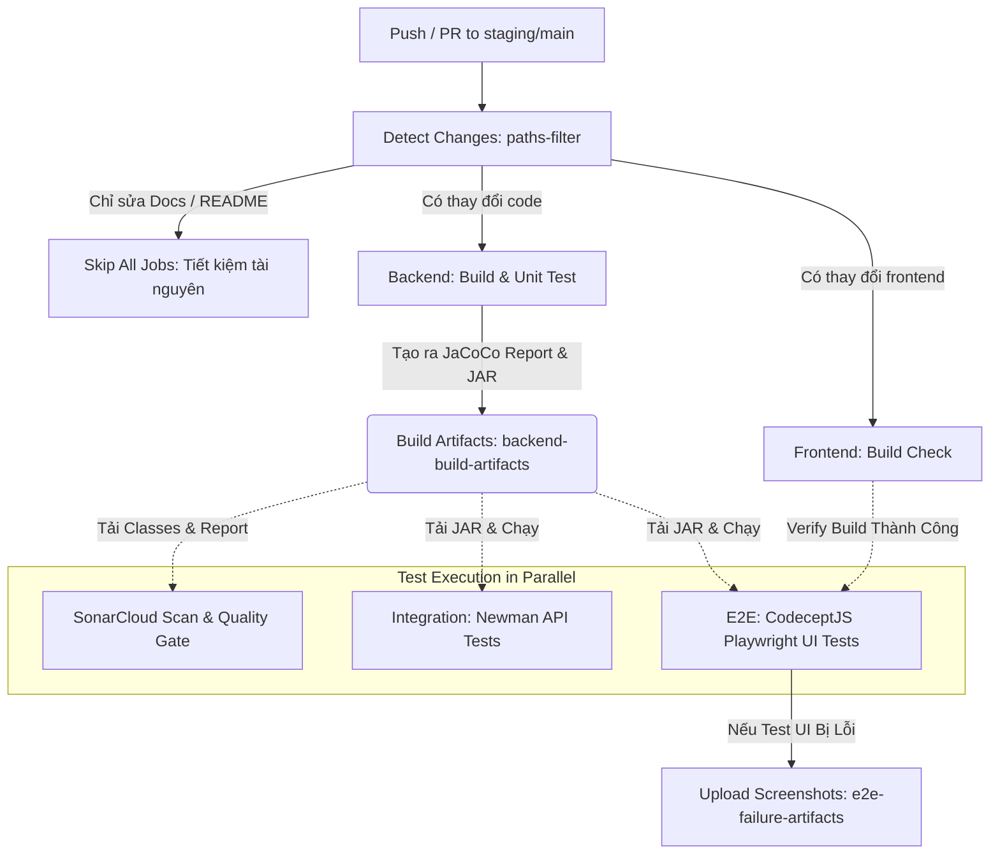

# Hướng Dẫn Cơ Chế Kiểm Thử Hệ Thống (System Testing & CI/CD Documentation)

Tài liệu này mô tả chi tiết kiến trúc kiểm thử tự động, cơ chế hoạt động của đường ống CI/CD (GitHub Actions), và những điểm cải tiến đột phá so với phiên bản cũ của hệ thống Doctor Booking.

---

## 1. So Sánh Trước & Sau Khi Tối Ưu (Before vs After)

| Tính Năng / Cơ Chế | Trước Khi Tối Ưu (Before) | Sau Khi Tối Ưu (After) | Lợi Ích Mang Lại |
| :--- | :--- | :--- | :--- |
| **Quản Lý Luồng SonarCloud** | 3 luồng chạy độc lập (trong `ci.yml` và `sonar.yml`) gây lãng phí tài nguyên và tạo nhiều phản hồi trùng lặp trên PR. | Gộp hoàn toàn vào luồng duy nhất (`sonar-gate`) trong `ci.yml`. | Giảm 66% số lần quét trùng lặp, tập trung báo cáo chất lượng mã nguồn trên PR. |
| **Chiến Lược Biên Dịch (Compilation)** | **Build Multiple Times**: Mỗi job (`backend-build`, `integration-test`, `sonar`) tự tải JDK và biên dịch lại code từ đầu bằng Maven. | **Build Once, Test Anywhere**: Biên dịch + chạy unit test đúng 1 lần ở `backend-build`. Đóng gói JAR/Classes thành Build Artifact và tái sử dụng cho tất cả các job sau. | Tiết kiệm 40% - 50% thời gian chạy CI (Wall-clock time) và tránh lãng phí CPU của GitHub Runner. |
| **Lọc Đường Dẫn Tự Động (Path Filtering)** | Bất kỳ thay đổi nào (kể cả sửa một file tài liệu `README.md`) cũng kích hoạt biên dịch toàn bộ hệ thống. | Tích hợp `dorny/paths-filter`. Hệ thống tự nhận diện vùng thay đổi (backend, frontend, postman, docs) để kích hoạt/bỏ qua các job tương ứng. | Tránh kích hoạt CI vô ích khi chỉ cập nhật tài liệu hoặc thay đổi nhỏ. |
| **Độ Phủ Mã Nguồn (Code Coverage)** | SonarCloud chỉ phân tích tĩnh (Static Analysis) chứ không nhận diện được phần trăm độ phủ kiểm thử của Unit Test. | Tích hợp `jacoco-maven-plugin`. Báo cáo XML được lưu trữ và đẩy lên SonarCloud để chấm điểm Quality Gate. | Đảm bảo tính minh bạch về chất lượng mã nguồn, kiểm soát chặt chẽ tỷ lệ bao phủ code. |
| **Đồng Bộ Hóa Khởi Động (Sync)** | Sử dụng lệnh `sleep 5` thô sơ trong bash script để đợi Backend chạy. Dễ gây lỗi timeout nếu máy chủ CI tải chậm. | Sử dụng thư viện chuyên dụng `wait-on` để lắng nghe chuẩn xác cổng HTTP (`5173` và `/api/public/health`). | Đường ống ổn định 100%, triệt tiêu lỗi fail ảo (flaky tests) do Backend khởi động chậm. |
| **Dữ Liệu Thử Nghiệm (DB Seeding)** | Không có cơ chế nạp sẵn dữ liệu. Kiểm thử viên phải tự tạo tài khoản kiểm thử thủ công trước khi test. | Tự động kích hoạt seeding (`patient1`, `doctor1`) thông qua `DataInitializer` khi nhận diện biến môi trường `SEED_TEST_DATA=true`. | Bảo đảm môi trường database luôn ở trạng thái chuẩn trước khi chạy Newman API hay CodeceptJS UI. |
| **UI E2E Testing** | Chưa được tích hợp vào hệ thống CI/CD. | Tích hợp **CodeceptJS (Playwright Engine)** chạy Chromium Headless trực tiếp trên CI. | Phát hiện sớm các lỗi giao diện, lỗi logic luồng nghiệp vụ trên UI trước khi deploy. |
| **Xử Lý Lỗi Kiểm Thử UI** | Chạy headless nên khi lỗi kiểm thử viên "mù" thông tin, không biết UI hiển thị lỗi gì. | Tự động kích hoạt plugin `screenshotOnFail`. Nếu lỗi, CI sẽ tự động chụp màn hình và đóng gói đẩy lên GitHub Artifacts. | Hỗ trợ debug nhanh chóng bằng hình ảnh thực tế từ trình duyệt của Runner. |

---

## 2. Sơ Đồ Kiến Trúc CI/CD Pipeline (Mermaid)



---

## 3. Cơ Chế Hoạt Động Của Các Tầng Kiểm Thử

### 3.1. Tầng Unit Test (Kiểm Thử Đơn Vị)
* **Công cụ**: JUnit 5, Mockito.
* **Mục tiêu**: Kiểm tra các logic nghiệp vụ lõi (ví dụ: tính toán hạn mức ví, nâng hạng loyalty tier, chặn sửa feedback quá 24 giờ).
* **Cơ chế Coverage**: 
  * Khi chạy `./mvnw clean verify`, mã nguồn được kích hoạt đo đạc bởi JaCoCo Agent.
  * Kết quả sinh ra file báo cáo tại [backend/target/site/jacoco/jacoco.xml](file:///c:/Users/DAT/OneDrive%20-%20ut.edu.vn/Documents/Desktop/Repo/backend/target/site/jacoco/jacoco.xml).

### 3.2. Tầng Integration Test (Kiểm Thử Tích Hợp API - Newman)
* **Công cụ**: Newman (Postman CLI), Docker MySQL.
* **Cách thức vận hành trên CI**:
  1. Khởi chạy MySQL Docker Container.
  2. Khởi chạy file JAR Backend đã được biên dịch từ bước trước bằng lệnh:
     ```bash
     SEED_TEST_DATA=true java -jar backend/target/backend-0.0.1-SNAPSHOT.jar &
     ```
  3. Sử dụng `wait-on` đợi tín hiệu từ cổng `8080` (Endpoint `/api/public/health` trả về trạng thái `"UP"`).
  4. Newman chạy tuần tự 23 thư mục kiểm thử (từ cấu hình tài khoản, đặt lịch, khám bệnh, thanh toán VNPAY, đến kiểm thử AI).

### 3.3. Tầng E2E Test (Kiểm Thử Giao Diện Trực Quan)
* **Công cụ**: CodeceptJS kết hợp với engine Playwright (chạy headless trên CI).
* **Cách thức vận hành trên CI**:
  1. Khởi chạy MySQL và chạy Backend JAR tương tự Newman.
  2. Khởi chạy Vite Dev Server ở Frontend (`npm run dev &`).
  3. Lệnh `wait-on` lắng nghe cả cổng Frontend (`5173`) và Backend (`8080`) online hoàn toàn.
  4. Trình duyệt ảo Chromium khởi chạy không giao diện (headless) để thực thi các kịch bản tương tác (click, fill field, assert điều hướng).
  5. **Mã nguồn kịch bản**: Định nghĩa tại [login_test.js](file:///c:/Users/DAT/OneDrive%20-%20ut.edu.vn/Documents/Desktop/Repo/frontend/e2e/login_test.js):
     * *Scenario 1*: Nhập sai thông tin đăng nhập -> Đợi hiển thị cảnh báo lỗi.
     * *Scenario 2*: Nhập đúng tài khoản `patient1` / `password123` -> Kiểm tra điều hướng về `/patient/dashboard` và thấy được menu sidebar "Bảng điều khiển".

---

## 4. Cách Sử Dụng Ở Môi Trường Local (Local Development)

### 4.1. Chạy Seeding Dữ Liệu Lên Local DB
Để chuẩn bị các tài khoản test nhanh chóng, bạn có thể chạy Backend kèm cờ Seeding:
```bash
# Windows (PowerShell)
$env:SEED_TEST_DATA="true"; ./mvnw spring-boot:run

# Linux / macOS
SEED_TEST_DATA=true ./mvnw spring-boot:run
```
Hệ thống sẽ tự động thêm tài khoản `patient1` và `doctor1` vào DB nếu chưa tồn tại.

### 4.2. Chạy Kiểm Thử UI Bằng CodeceptJS
Khi đang code giao diện ở frontend và muốn chạy bộ test E2E để kiểm tra:
```bash
cd frontend

# Chạy có giao diện trình duyệt trực quan (dùng để phát hiện lỗi trực tiếp)
npm run test:e2e

# Chạy không giao diện (headless - giống như trên CI)
npm run test:e2e:headless
```
*Lưu ý: Đảm bảo cả máy chủ Backend và Vite Frontend đang chạy trước khi kích hoạt bộ test.*

---

## 5. Nguyên tắc F.I.R.S.T Cho Unit Test (Whitebox)

Để duy trì chất lượng Unit Test khi dự án mở rộng, toàn bộ test case phải tuân thủ 5 nguyên tắc F.I.R.S.T:

* **Fast (Nhanh):** Test phải chạy cực kỳ nhanh (mili-giây). Tuyệt đối không kết nối CSDL thật hay gọi API ngoài trong Unit Test (dùng `@Mock` và `@InjectMocks` của Mockito để giả lập).
* **Independent (Độc lập):** Các test case không được phụ thuộc vào nhau. Thứ tự chạy ngẫu nhiên (hoặc chạy song song) không làm thay đổi kết quả Pass/Fail. Dữ liệu mock phải được khởi tạo lại trước mỗi test (dùng `@BeforeEach`).
* **Repeatable (Lặp lại được):** Test phải Pass ở mọi môi trường (Local, CI/CD, chạy sáng hay tối) mà không bị "Flaky".
* **Self-validating (Tự xác thực):** Test phải có các câu lệnh `assert` (như `assertEquals`, `assertThatThrownBy`) để tự động kết luận Xanh/Đỏ, không yêu cầu dev phải đọc console log.
* **Timely (Kịp thời):** Code test phải được viết cùng lúc với code logic (khuyến khích viết trước theo TDD).

> [!IMPORTANT]
> Dự án đã được cấu hình JaCoCo check rule. Lệnh `mvn clean verify` ở local sẽ **đánh Fail toàn bộ quá trình build** nếu độ phủ lệnh (Line Coverage) hoặc độ phủ nhánh (Branch Coverage) của dự án dưới **80%**. Hãy "Fail Fast" ở máy bạn trước khi đẩy lên CI!

---

## 6. Mutation Testing (Kiểm Thử Đột Biến với PiTest)

Dù đạt 100% Code Coverage, test case vẫn có thể vô dụng nếu thiếu các lệnh `assert` chặt chẽ. Để giải quyết, dự án áp dụng **Mutation Testing** thông qua thư viện PiTest.

### Cơ Chế Hoạt Động
1. PiTest tự động sửa đổi mã nguồn thực tế (tạo ra các "Mutant"). Ví dụ: đổi `>` thành `>=`, đổi `+` thành `-`, xóa lời gọi hàm.
2. PiTest chạy bộ Unit Test của bạn lên các Mutant này.
3. Nếu Unit Test của bạn báo Đỏ (Fail) -> Mutant bị **Killed** (Tốt: Test của bạn đủ chặt chẽ để bắt được lỗi sửa code).
4. Nếu Unit Test vẫn báo Xanh (Pass) -> Mutant **Survived** (Xấu: Test của bạn quá lỏng lẻo, code thay đổi sai mà test không nhận ra).

### Cách Chạy và Đọc Báo Cáo
Ở local, bạn có thể chạy:
```bash
./mvnw pitest:mutationCoverage
```
* Báo cáo HTML sinh ra tại `backend/target/pit-reports/index.html`.
* **Giai đoạn hiện tại**: PiTest chạy ở chế độ *Report-Only* (chỉ sinh báo cáo, không chặn build). Hãy tập thói quen mở báo cáo này để tìm những đoạn code quan trọng có Mutant "Survived" và viết thêm `assert` để tiêu diệt chúng. Mức Mutation Score sẽ dần được nâng lên thành Quality Gate chặn luồng CI trong các Sprint tới.
