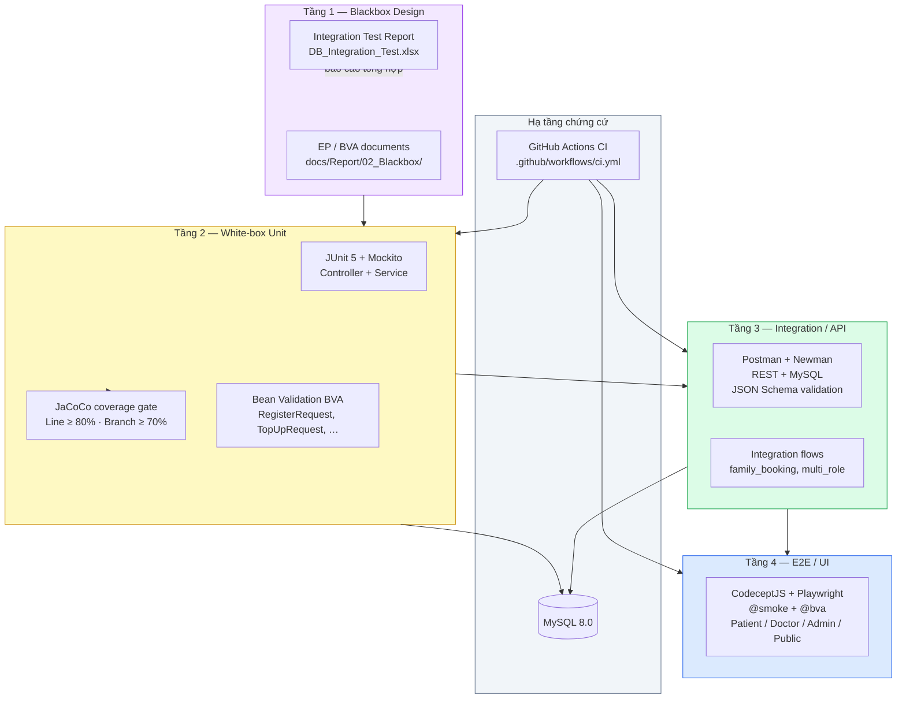
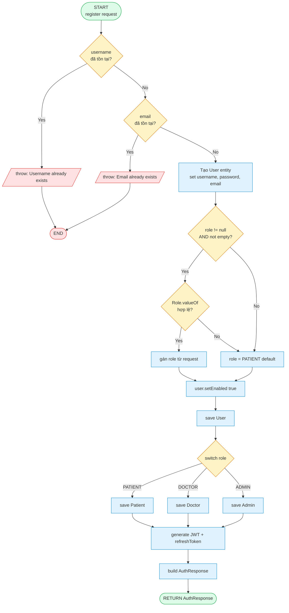
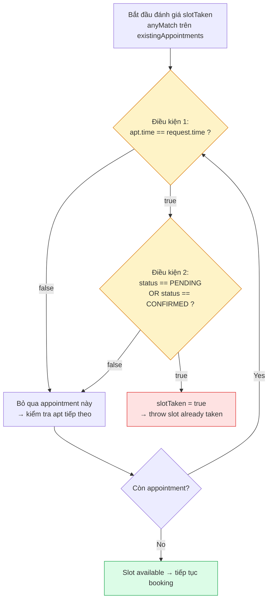
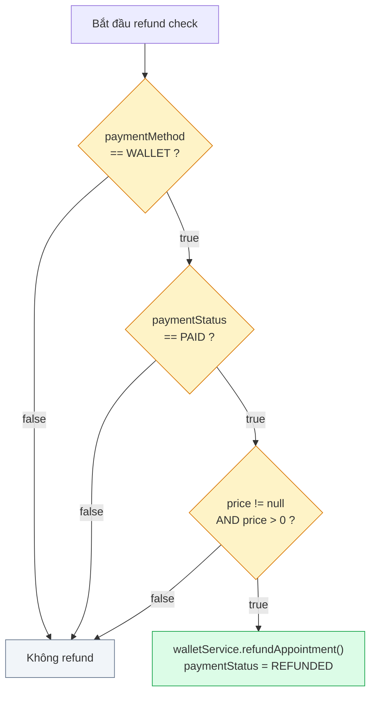
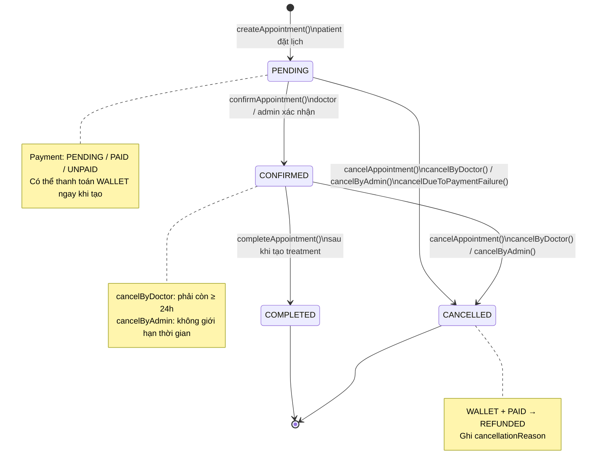
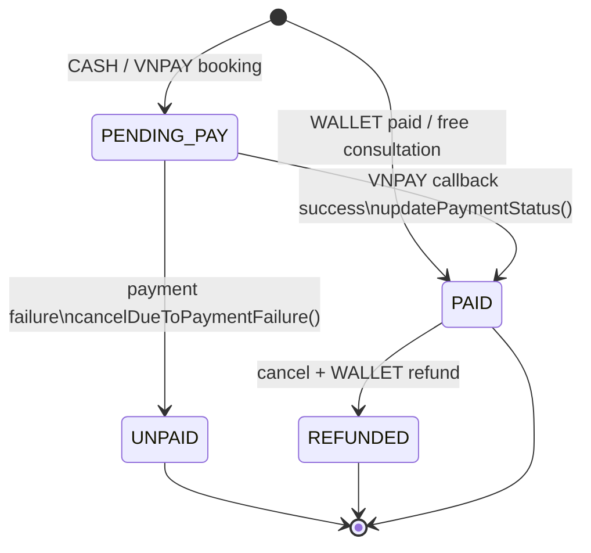
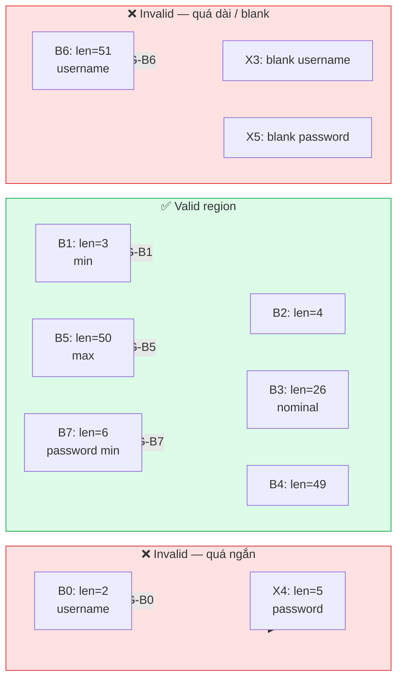
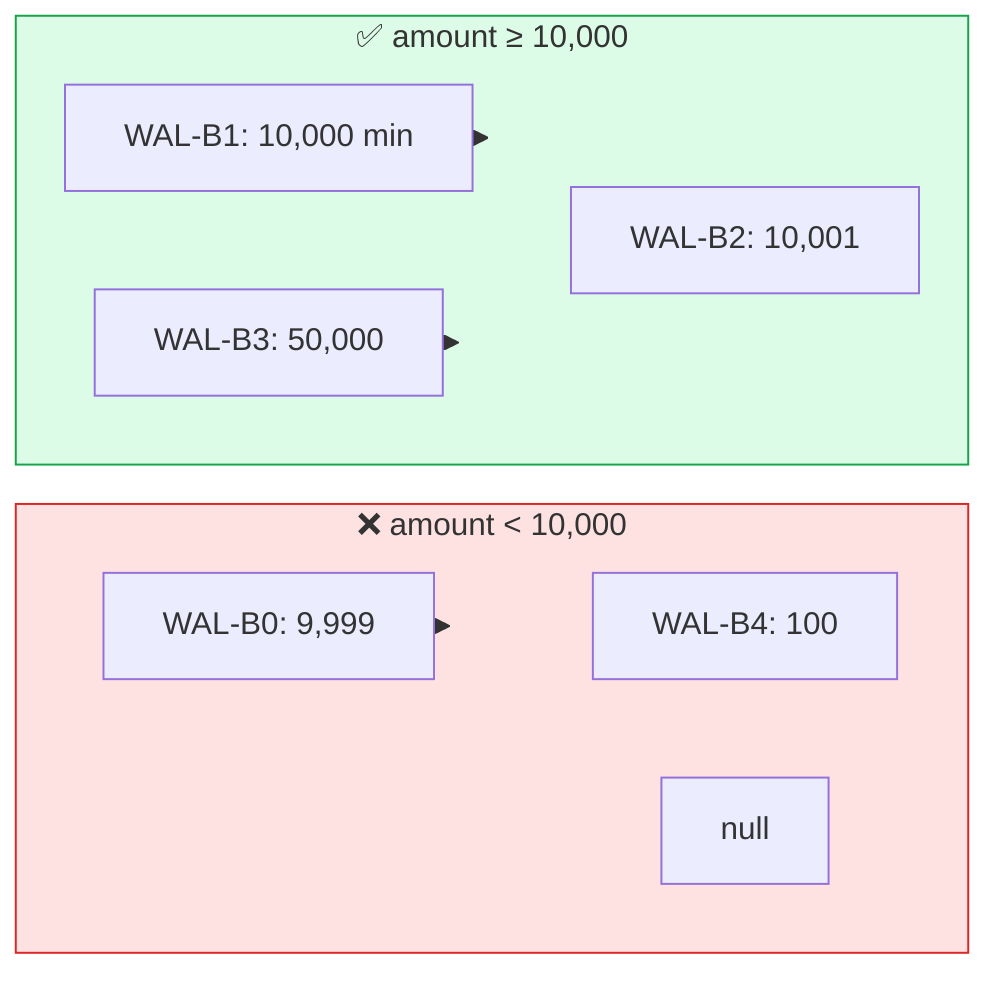

# Testing Diagrams (Mermaid)

> Doctor Booking System 2026 — dùng cho báo cáo `docs/Report/`
>
> Mở file này trong VS Code / GitHub / Cursor để preview Mermaid, hoặc export PNG tại [mermaid.live](https://mermaid.live).
>
> Khi dùng Mermaid Live Editor, chỉ copy phần **bên trong** khối code, bắt đầu từ `flowchart`, `stateDiagram-v2`, ... Không copy dòng ```mermaid và ``` vì sẽ gây `UnknownDiagramError`.

---

## 1. Test Layers / Test Pyramid




---


## 2. CFG — `AuthService.register()`

Control Flow Graph cho method white-box chính (đăng ký tài khoản).




**Path coverage tiêu biểu:**


| Path | Mô tả                           | Test                                 |
| ---- | ------------------------------- | ------------------------------------ |
| P1   | username trùng                  | `AuthServiceTest` / Postman negative |
| P2   | email trùng                     | `AuthServiceTest` / Postman negative |
| P3   | role hợp lệ → PATIENT           | `AuthServiceTest.register_success`   |
| P4   | role invalid → fallback PATIENT | `AuthServiceTest`                    |
| P5   | role DOCTOR / ADMIN             | service branch tests                 |


---


## 3. Short-circuit — điều kiện phức tạp


### 3a. Slot đã bị book — `createAppointment()` line 143–148




**Short-circuit** `&&`**:** Nếu `apt.time != request.time` → **không** đánh giá `status` (điều kiện 2 bị bỏ qua).

### 3b. Hoàn tiền WALLET — `processRefundIfNeeded()` / `cancelAppointment()`




**Test evidence:** `AppointmentServiceExtraTest.cancelByDoctor_walletRefund`, `cancelAppointment_wallet_refund`

---


## 4. State Transition — Appointment Lifecycle




**Payment status (song song):**




---


## 5. BVA Boundary — Register (`username` + `password`)




### BVA bổ sung — Wallet Top-up `amount ≥ 10,000 VNĐ`




**Evidence:** `RegisterRequestValidationTest`, `TopUpRequestValidationTest`, `register_bva_test.cjs`, `wallet_bva_test.cjs`

---


## 6. Traceability — Ticket → Test → Evidence

```mermaid
flowchart TB
    subgraph BLACKBOX["Blackbox SCRUM-195 → 208"]
        T195["SCRUM-195 Register"]
        T196["SCRUM-196 Login"]
        T197["SCRUM-197 Booking"]
        T200["SCRUM-200 Wallet"]
        T205["SCRUM-205 E2E Patient"]
    end

    subgraph WHITEBOX["White-box SCRUM-209 → 212"]
        T209["SCRUM-209 JaCoCo gate"]
        T210["SCRUM-210 Controllers"]
        T211["SCRUM-211 Services"]
        T212["SCRUM-212 AppointmentService"]
    end

    subgraph DOCS["Tài liệu"]
        D_REG["EP_BVA_Register.md"]
        D_APT["EP_BVA_Appointment_Booking.md"]
        D_WAL["EP_BVA_Wallet_TopUp.md"]
        D_COV["coverage-summary.md"]
        D_XLS["DB_Integration_Test.xlsx"]
    end

    subgraph AUTO["Test tự động"]
        J_REG["RegisterRequestValidationTest"]
        J_APT["AppointmentServiceTest<br/>AppointmentServiceExtraTest"]
        J_CTRL["AuthControllerTest<br/>PatientControllerTest<br/>…"]
        P_AUTH["Postman 02_Auth"]
        P_APT["Postman 05_Appointments"]
        E_REG["register_bva_test.cjs"]
        E_APT["booking_bva_test.cjs"]
        E_WAL["wallet_bva_test.cjs"]
        E_SMOKE["patient/* smoke tests"]
    end

    subgraph PROOF["Chứng cứ"]
        C1["commit docs + e2e"]
        C2["f8db3c9 pom.xml"]
        C3["44dd87a controller tests"]
        C4["fd6bbf5 AppointmentService"]
        CI_RUN["GitHub Actions CI green"]
        JACOCO["jacoco/index.html"]
    end

    T195 --> D_REG --> J_REG & P_AUTH & E_REG
    T196 --> J_REG & P_AUTH & E_REG
    T197 --> D_APT --> J_APT & P_APT & E_APT
    T200 --> D_WAL --> E_WAL
    T205 --> E_SMOKE

    T209 --> D_COV --> C2 --> JACOCO
    T210 --> J_CTRL --> C3
    T211 --> J_APT
    T212 --> J_APT --> C4

    D_XLS -.-> BLACKBOX & WHITEBOX
    BLACKBOX & WHITEBOX --> CI_RUN

    style BLACKBOX fill:#f3e8ff,stroke:#9333ea
    style WHITEBOX fill:#fef9c3,stroke:#ca8a04
    style DOCS fill:#e0f2fe,stroke:#0284c7
    style AUTO fill:#dcfce7,stroke:#16a34a
    style PROOF fill:#f1f5f9,stroke:#64748b
```




### Ma trận rút gọn


| Ticket    | Document                        | JUnit                           | Postman           | E2E                     | Commit     |
| --------- | ------------------------------- | ------------------------------- | ----------------- | ----------------------- | ---------- |
| SCRUM-195 | `EP_BVA_Register.md`            | `RegisterRequestValidationTest` | `02_Auth`         | `register_bva_test.cjs` | docs batch |
| SCRUM-197 | `EP_BVA_Appointment_Booking.md` | `AppointmentServiceTest`        | `05_Appointments` | `booking_bva_test.cjs`  | —          |
| SCRUM-200 | `EP_BVA_Wallet_TopUp.md`        | `TopUpRequestValidationTest`    | `09_Wallet`       | `wallet_bva_test.cjs`   | —          |
| SCRUM-209 | `coverage-summary.md`           | —                               | —                 | —                       | `f8db3c9`  |
| SCRUM-210 | —                               | `*ControllerTest` (9 files)     | —                 | —                       | `44dd87a`  |
| SCRUM-212 | —                               | `AppointmentServiceExtraTest`   | —                 | —                       | `fd6bbf5`  |


